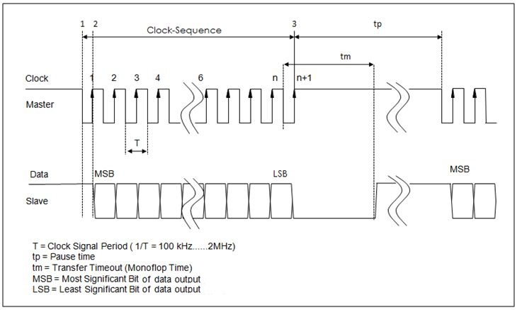
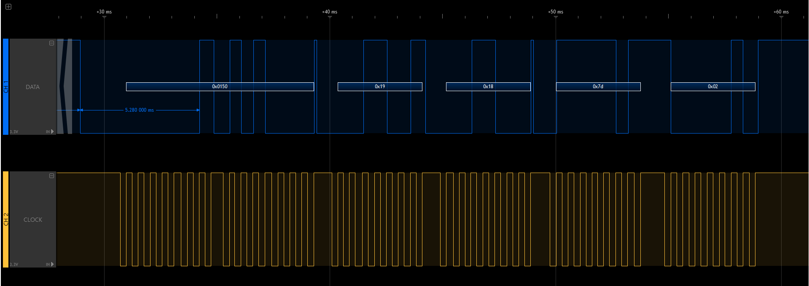
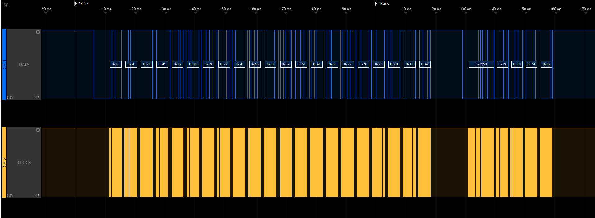
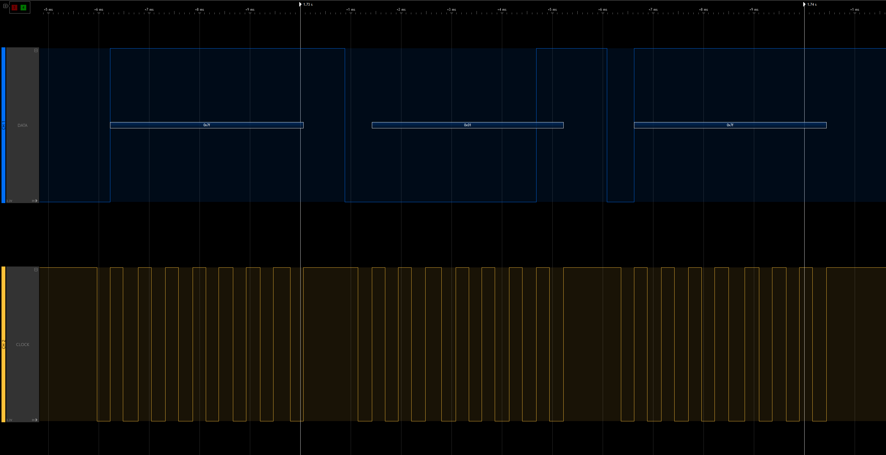

# Scantronic 9751/9752 Alarm Remote Control Peripheral interface and communication protocol

This page describes the Peripheral interface and communication protocol in detail.

## The Peripheral Interface

The Alarm System contains an interface to which the extension unit and the Control
Panels are connected. This is a 4-pin connector with these connections:
* 0V
* 12V
* CLK
* DATA

Only the data from the control panel and from the extension board is available on this connector. All PIRs connected to the main board are not visible on this interface. Neither is the status of the Alarm System directly visible on this port since the communication is stateless.

The DATA and CLK lines are based on a [Synchronous Serial Interface](https://en.wikipedia.org/wiki/Synchronous_Serial_Interface).
This is the typical structure of a data frame:

Some details:
* The communication is half-duplex. There is only 12V/GND, the signal is not differential.

  Note that there is no difference between Tx/Rx: All incoming and outgoing data is mapped to the same DATA line. The device that pulls down the
  DATA line first has the control of the bus.
* When idle, the CLK and DATA lines are on a +12 Volt level, and in tri-state mode.
* Data starts when the CLK line goes from High to low (1). All bits are read on each rising edge (2-3).
* T is nominal about 500uS, leading to max. 2kHz clock frequency, but there is some variation on the stability of the clock (T=500uS - 540uS).
* Each byte is seperated by about 1 millisecond pause, the distance between 2 messages (tp) is minimal 5ms.
* Max length of a single message is 21 bytes.

Example messages:
|1 long message|2 messages in a sequence|1 short message|
|---|---|---|
||||

All messages contain a checksum mechanism:
* All messages are a sequence of 8-bit bytes.
* A checksum is calculated and appended to each stream of bytes as 2 independent bytes, although some messages only use 1 checksum value.
* The formula to calculate a checksum is like this:
  * CHKSUM1 = Calculated as "0x7f - CHKSUM2"
  * CHKSUM2 = (BYTE0 + BYTE1 + BYTE2 + ... + BYTE_N) & 0x7f
    (= add up all the bytes in the message, except the checksum bytes en bitwise OR it with 0x7f)

## Interface to the control panels

The Control Panels are 'dumb' devices, which means they do not maintain state of the alarm system:
* All key presses are sent to the main board immediately after pressing any key. The main board responds with what the control panel needs to display.
* All messages on the screen are only sent to the control panel that initiated the activity. All data traffic is unencrypted.
* Some information, like date and time, is broadcasted to all panels.

### Key press data format

All key presses follow this data structure.

|BYTE0|BYTE1|BYTE2|BYTE3|BYTE4|BYTE5|
|---|---|---|---|---|---|
|DEST|SRC|DATA0|DATA1|CHKSUM1|CHKSUM2|

* DEST: The ID of the Main Control Board, always: 0x00
* SRC:  The ID of the Control Panel that sents the message: 0x30 for the 1st control panel, 0x31 for the 2nd.
* DATA0: 0x00
* DATA1: The ASCII code for the button pressed:
    |Key|Value|\||Key|Value|
    |---|---|---|---|---|
    |0|0x30|\||A|0x41|
    |1|0x31|\||B|0x42|
    |2|0x32|\||C|0x43|
    |3|0x33|\||D|0x44|
    |4|0x34|\||V|0x0d (=Enter)|
    |5|0x35|\||X|0x1b (=ESC)|
    |6|0x36|\||||
    |7|0x37|\||||
    |8|0x38|\||||
    |9|0x39|\||||
* CHKSUM1 = see above
* CHKSUM2 = see above

### Control Panel display update

All lines to be displayed on the screen are sent in plain text from the mainboard to the control panel.
The control panel simply displays what it receives from the main control panel.

There are 2 options:
1) message specific for 1 control panel
2) Broadcast of a message to all panels.

#### Option 1: Message for a single panel
|BYTE0|BYTE1|BYTE2|BYTE3-BYTE18|BYTE19|BYTE20|
|---|---|---|---|---|---|
|DEST|LINE|0x7F|TEXT|CHKSUM1|CHKSUM2|

* DEST: The ID of the Control Panel: 0x30 for the 1st panel, 0x31 for the 2nd panel.
* LINE:
    * 0x2F = The 1st line on the screen
    * 0x4F = The 2nd line of the screen
* TEXT: Always 16 bytes of ASCII data to be displayed on the screen.
* CHKSUM1 = see above
* CHKSUM2 = see above

#### Option 2: Boardcast message to all panels
|BYTE0|BYTE1|BYTE2|BYTE3-BYTE18|BYTE19|
|---|---|---|---|---|
|DEST|LINE|0x7F|TEXT|CHKSUM1|

* DEST: 0x3f
* LINE:
    * 0x2F = The 1st line on the screen
    * 0x4F = The 2nd line of the screen
* TEXT: Always 16 bytes of ASCII data to be displayed on the screen.
* CHKSUM1 = see above (CHKSUM2 is NOT sent to the panel in case of broadcast).
