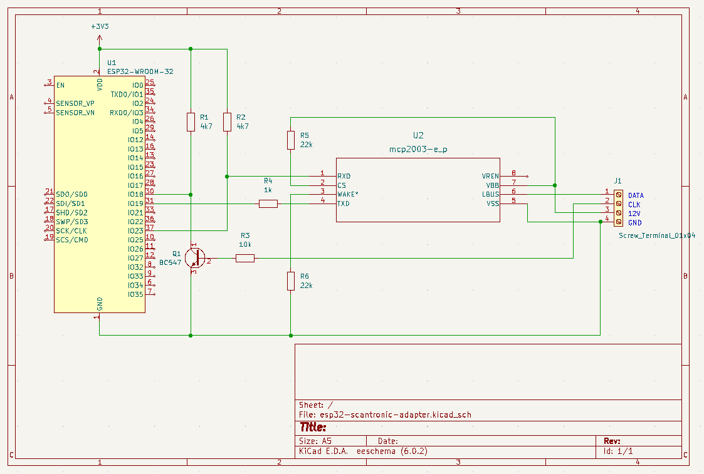

# Scantronic 9751/9752 Alarm Remote Control Peripheral interface Schematics

This is an initial schematics version for adding an ESP32 to emulate the control panel. (NOT TESTED YET!)

We use a LIN-bus transceiver as level shifter from 12v line level to 3v3 for the ESP32, and a simple transistor for converting the
clock signal to a proper 3v3 level, this inverts the clock signal, but that can be solved by selecting the proper SPI mode.

The schematics are designed with KiCAD, and can be found in the schematics folder
